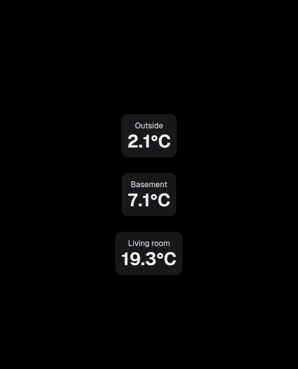

# Temperature Web Dashboard

## Overview

This is a simple web dashboard for the temperature measured by
[ESP8266 controller(s)](https://github.com/ingui-n/thermometer-client) and saved to Pocketbase database by another
[ESP8266](https://github.com/ingui-n/thermometer-controller).

The dashboard is build with Next.js and NextUI.

## Requirements

- Running Pocketbase from [this](https://github.com/ingui-n/thermometer-database) repository

## Prerequisites

- Docker
- Docker Compose

## Installation

1. Clone this repository
2. Rename `.env-template` to `.env` and fill in the values
3. Start the dashboard application with `docker compose up -d`

## Screenshot

